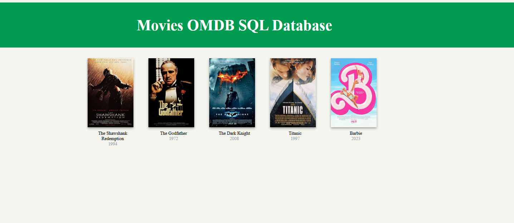

# Movie Database App

A simple command-line app to manage a personal movie database (SQLite), look up movies via the OMDb API, and generate a static HTML website to browse them.



## Setup

```bash
pip install -r requirements.txt
```

Create a `.env` file in the project root with your OMDb API key:

```
OMDB_API_KEY=your_api_key_here
```

## Usage

```bash
python movies.py
```

Use the menu to list, add, delete, update, or search movies, view stats, and generate the website (option 9).

## Generated website

Running "Generate Website" fills in `templates/index_template.html` and writes the result to `static/index.html`. Example output:

```html
<html>
<head>
    <title>My Movie App</title>
    <link rel="stylesheet" href="style.css"/>
</head>
<body>
<div class="list-movies-title">
    <h1>My Movie App</h1>
</div>
<div>
    <ol class="movie-grid">
        <li>
            <div class="movie">
                
                <div class="movie-title">The Dark Knight</div>
                <div class="movie-year">2008</div>
            </div>
        </li>
        <li>
            <div class="movie">
                
                <div class="movie-title">Pulp Fiction</div>
                <div class="movie-year">1994</div>
            </div>
        </li>
    </ol>
</div>
</body>
</html>
```
